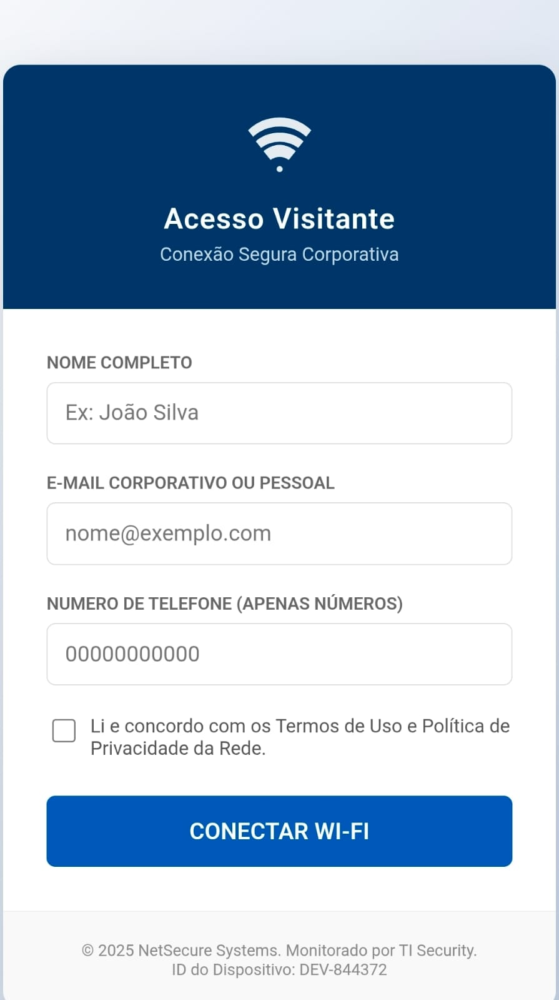

# Exploracao-Vulnerabilidade-HTTP
🔐 Exploração de Vulnerabilidades em Redes Wireless com Foco em HTTP Inseguro
<div align="center">

# 🔐 Exploração de Vulnerabilidades em Redes Wireless & Engenharia Social


<br>

> **⚠️ AVISO LEGAL (DISCLAIMER)**
> 
> Este repositório contém documentação e códigos desenvolvidos estritamente para fins acadêmicos na disciplina de **Redes de Computadores II**. Todas as demonstrações foram realizadas em ambiente controlado (Laboratório Virtual), utilizando dados fictícios e dispositivos próprios.

</div>

---
<br>

## 📑 1. Sumário Executivo
⚠️ AVISO LEGAL (DISCLAIMER)
Este repositório foi produzido exclusivamente para fins acadêmicos na disciplina de Redes de Computadores II.
Todos os testes foram realizados em ambiente isolado, com dados fictícios e consentidos, seguindo as orientações de segurança do curso.

Este projeto apresenta uma Prova de Conceito (PoC) demonstrando a **insegurança do protocolo HTTP** em redes públicas. O experimento simula um ataque de *Rogue Access Point* (Ponto de Acesso Malicioso) combinado com Engenharia Social para capturar credenciais de usuários em texto claro (*Cleartext*).
</div>
📑 1. Sumário Executivo

### 🎯 Objetivos do Projeto
- [x] Criar um ambiente controlado de ataque Wireless.
- [x] Demonstrar a interceptação de dados sem criptografia (TLS/SSL).
- [x] Analisar o tráfego de rede (`.pcap`) com Wireshark.
- [x] Desenvolver medidas de mitigação (Defesa).
Este projeto apresenta uma Prova de Conceito (PoC) sobre a exploração de vulnerabilidades em redes Wi-Fi públicas e o impacto do uso do protocolo HTTP sem criptografia.
O cenário simulado envolve um Rogue Access Point associado a uma técnica de Engenharia Social, com o objetivo de demonstrar a captura de credenciais enviadas em cleartext.

---
🎯 Objetivos

## 🏗️ 2. Arquitetura e Topologia
Criar um ambiente controlado de rede wireless vulnerável.

O laboratório foi configurado utilizando uma abordagem híbrida para contornar restrições de hardware físico.
Demonstrar a interceptação de dados transmitidos via HTTP.

| Componente | Especificação | Função no Ataque |
| :--- | :--- | :--- |
| **🖥️ Host Físico** | Windows 10/11 + Adaptador Intelbras | **Infraestrutura:** Provedor de Acesso (Hotspot) |
| **🏴‍☠️ Atacante** | Kali Linux (VirtualBox Bridge) | **Servidor:** Hospedagem do Phishing + Sniffer |
| **📱 Vítima** | Smartphone/Computador | **Cliente:** Conectado à rede maliciosa |
Registrar e analisar pacotes em um arquivo PCAP usando Wireshark.

---
Apresentar contramedidas de segurança.

## ⚙️ 3. Metodologia: O Desafio e a Solução
Disponibilizar documentação completa e reprodutível.

### 🔴 O Problema (Restrição de Infraestrutura)
O plano original baseava-se num ataque *Man-in-the-Middle* (MitM) via **ARP Spoofing**. Contudo, a infraestrutura revelou-se protegida, pois o *driver* de Hotspot do Windows ativa nativamente o **Isolamento de Cliente** (*Client Isolation*).
> *Esta configuração de segurança impede que dispositivos ligados à mesma rede Wi-Fi comuniquem diretamente entre si (bloqueio Peer-to-Peer). Consequentemente, o atacante não consegue manipular a tabela ARP das vítimas, tornando a interceção de tráfego inviável.*
🏗️ 2. Arquitetura e Topologia

### 🟢 A Solução (Engenharia Social)
Para ultrapassar esta barreira, o vetor de ataque foi alterado para **Phishing Assistido**, explorando a camada humana em vez da camada de rede.
> *Ao invés de tentar capturar pacotes "no ar", a estratégia foca-se em persuadir o utilizador a fornecer voluntariamente as credenciais. Isto contorna as restrições de hardware, provando que a falha reside na confiança do utilizador.*
O ambiente foi construído com uma topologia híbrida devido a limitações de hardware físico:

#### 🔗 Ferramentas de Indução (QR Codes)
A tabela a seguir apresenta as duas ferramentas visuais utilizadas na simulação para guiar a vítima ao servidor malicioso:
Componente	Especificação	Função
Host Físico (Windows 10/11)	Hotspot Integrado	Provê rede Wi-Fi para o teste
Atacante (Kali Linux)	VM em modo Bridge	Hospeda o servidor malicioso e realiza o sniffing
Vítima	Smartphone/PC	Acessa o portal falso e envia dados
⚙️ 3. Metodologia
3.1 Limitações Identificadas

<div align="center">
O plano original considerava um ataque Man-in-the-Middle (MitM) por ARP Spoofing.
Porém, o Hotspot nativo do Windows aplica automaticamente Client Isolation, impedindo comunicação direta entre os dispositivos conectados.

| 1. QR Code de Conexão (Fase de Engano) | 2. QR Code de Validação (O Gatilho) |
| :---: | :---: |
| **Função:** Simula um acesso legítimo à rede e credibilidade. | **Função:** Redireciona a vítima ao IP do atacante (`http://192.168.137.177`). |
|  |  |
Isso inviabiliza o spoofing ARP, pois a vítima não recebe respostas ARP falsas provenientes do atacante.

<p>
    <i>O escaneamento do código da direita é a ação crítica que inicia a captura das credenciais.</i>
</p>
</div>
3.2 Adaptação da Estratégia (Engenharia Social)

Diante da impossibilidade de manipular o tráfego interno, adotou-se uma abordagem baseada no fator humano.

------
## 🔄. Ciclo de Vida do Ataque (Attack Lifecycle)
Vetor Utilizado: QR Code Malicioso

O ataque ocorre em três estágios técnicos distintos. Abaixo, detalhamos o fluxo de dados e a vulnerabilidade explorada em cada fase:
Foram criados dois QR Codes com funções distintas:

```mermaid
<div align="center">
QR Code de Acesso	QR Code de Validação
Simula credibilidade de acesso ao Wi-Fi	Redireciona ao IP do atacante (http://192.168.137.xxx)
	
</div>
🔄 4. Ciclo de Vida do Ataque
sequenceDiagram
    participant V as Vítima (Celular)
    participant R as Roteador (Windows)
    participant V as Vítima
    participant R as Roteador (Hotspot)
    participant A as Atacante (Kali)

    Note over V, R: Estágio 1: Reconhecimento
    V->>R: Conecta no Wi-Fi
    V->>A: Broadcast (ARP/mDNS)
    Note right of A: 🚨 Captura de MAC e IP (Passiva)
    Note over V, R: Estágio 1 - Reconhecimento
    V->>R: Conexão ao Wi-Fi
    V->>A: Broadcast ARP/mDNS (captura passiva)

    Note over V, A: Estágio 2: Engenharia Social
    Note over V, A: Estágio 2 - Engenharia Social
    V->>V: Escaneia QR Code
    V->>A: Acessa Portal Falso (Porta 80)

    Note over V, A: Estágio 3: Exfiltração
    V->>A: Envia Formulário (HTTP POST)
    Note right of A: 🚨 Captura de Senha/CPF (Texto Puro)
```
### 📝 Detalhamento Técnico das Fases

#### 📡 Estágio 1: Reconhecimento Passivo (Conexão)
Ao conectar-se ao Wi-Fi, o dispositivo da vítima envia pacotes de *Broadcast* e *Multicast* (ARP/mDNS) para se anunciar na rede.
* **O que acontece:** O Wireshark captura passivamente esses pacotes na interface de rede.
* **Dados Vazados:** `Endereço MAC` (Camada 2) e `Endereço IP` (Camada 3).
* **Impacto:** 🚨 Identificação física do hardware e rastreio de presença, quebrando a privacidade do usuário antes mesmo do login.

#### 🔗 Estágio 2: A Isca (Engenharia Social)
Devido ao bloqueio de redirecionamento automático do Windows (*Client Isolation*), utilizamos um vetor humano. A vítima é exposta a um QR Code com a mensagem *"Escaneie para Validar o Acesso"*.
* **Técnica:** O QR Code atua como um link malicioso físico.
* **Resultado:** Ao escaneá-lo, o usuário autoriza explicitamente a conexão com o servidor do atacante (`http://192.168.137.177`), contornando o firewall do Host.

#### 🔓 Estágio 3: Exfiltração de Dados (O Roubo)
A vítima preenche o formulário de "Cadastro Wi-Fi" acreditando ser um procedimento padrão de autenticação.
* **A Vulnerabilidade:** O navegador envia os dados via método **HTTP POST**.
* **O Problema:** Como não há criptografia (SSL/TLS), os dados trafegam em **Texto Puro** (*Cleartext*).
* **A Captura:** O sniffer intercepta o pacote completo, revelando Nome, E-mail e Senhas.
  
--------

## 📸 4. Evidências e Prova Visual

### A. Interface Apresentada à Vítima
*A página de login de Wi-Fi, simulando um portal corporativo:*
    V->>A: Acessa o portal falso via HTTP

<div align="center">
    
    <br>
</div>
    Note over V, A: Estágio 3 - Exfiltração
    V->>A: Envio de formulário (HTTP POST)
    A->>A: Registro do pacote e dos dados em texto claro

### B. A Prova do Crime (Wireshark)
*Captura do pacote HTTP POST contendo os dados pessoais em texto puro:*
📝 5. Análise Técnica das Fases
📡 Estágio 1: Reconhecimento Passivo

<div align="center">
    
    <br>
</div>
Ao entrar no Wi-Fi, o dispositivo emite pacotes ARP e mDNS para se anunciar na rede.
Com isso, o atacante descobre:

---
MAC Address (camada 2)

## 📊 5. Análise de Exfiltração de Dados
Endereço IP (camada 3)

Durante a fase de exploração, a infraestrutura de monitoramento interceptou **100% das requisições de autenticação**. A inspeção profunda dos pacotes (Deep Packet Inspection) revelou a violação do pilar de **Confidencialidade**, expondo dados de contato em texto puro.
Essas informações permitem rastreabilidade e mapeamento da vítima.

Abaixo, a classificação dos ativos comprometidos:
🔗 Estágio 2: Engenharia Social

| Ativo (Campo) | Natureza do Dado | Classificação de Risco | Impacto Potencial |
| :--- | :--- | :--- | :--- |
| `txtNome` | Identificação | 🟠 **ALTO** | Engenharia Social e Perfilamento da Vítima. |
| `txtEmail` | Login / Contato | 🟠 **ALTO** | Vetor para Phishing Direcionado e Spam. |
| `txtTelefone` | **PII (Pessoal)** | 🔴 **CRÍTICO** | **Clonagem de WhatsApp, Smishing e Interceptação de SMS (2FA).** |
Sem redirecionamento automático (como um captive portal real), o QR Code funciona como um “atalho físico” para o servidor web malicioso.

> **Diagnóstico:** A ausência de criptografia de transporte (TLS) permitiu a leitura integral do payload. O vazamento do número de telefone expõe a vítima a ataques diretos em mensageiros instantâneos.
🔓 Estágio 3: Exfiltração de Dados

**Evidência Visual:**
*O print do Wireshark abaixo corrobora a falha, destacando a legibilidade dos campos no painel de inspeção:*
<div align="center">
    
    <br>
</div>
---
A vítima preenche um formulário acreditando ser um cadastro padrão da rede.

## 🛡️ 6. Contramedidas e Mitigação 
O envio ocorre com:

Para mitigar a vulnerabilidade demonstrada e proteger a rede contra ataques semelhantes, as seguintes medidas defensivas devem ser implementadas:
HTTP POST /login
Content-Type: application/x-www-form-urlencoded

### 1. Implementação de HTTPS (Criptografia de Transporte)
* **Mecanismo:** Utiliza o protocolo **TLS/SSL** (Transport Layer Security) para estabelecer um canal seguro, criptografando os dados no cliente.
* **Efeito:** Mesmo que o atacante intercepte os pacotes na rede local, o conteúdo estaria ilegível, frustrando o ataque de captura de credenciais.

### 2. Uso de VPN e Validação de Endpoint
* **Mecanismo:** Ao utilizar uma **VPN (Rede Privada Virtual)**, todo o tráfego da vítima é encapsulado em um túnel criptografado, impedindo a leitura por terceiros na rede local.
* **Mecanismo:** **HSTS** (HTTP Strict Transport Security) instrui o navegador a *nunca* carregar a página via HTTP, mitigando tentativas de downgrade ou acesso a links inseguros.
Como não há TLS, o conteúdo aparece completamente legível no Wireshark.

### 3. Conscientização do Usuário
* **Foco:** Treinar usuários para verificar a URL e a barra de segurança (cadeado verde/HTTPS) antes de inserir qualquer informação pessoal.
📸 6. Evidências
6.1 Portal Falso exibido à vítima
<div align="center">  </div>
6.2 Captura do POST no Wireshark
<div align="center">  </div>
📊 7. Classificação dos Dados Comprometidos
Campo	Tipo de Dado	Risco	Impacto
Nome	Identificação	Médio	Perfilamento da vítima
E-mail	Credencial de acesso	Alto	Phishing e roubo de identidade
Telefone	PII sensível	Crítico	Uso em golpes e engenharia social em mensageiros

---
## 🛠️ 7. Guia de Reprodução (Passo a Passo)
Diagnóstico:

Para replicar este laboratório de testes (*Proof of Concept*), siga as instruções detalhadas abaixo:
A ausência de criptografia de transporte compromete a confidencialidade e expõe integralmente os dados inseridos pela vítima.

### 1. Preparação do Ambiente (Pré-requisitos)
🛡️ 8. Contramedidas e Recomendações

* **Infraestrutura:** Computador Host (Windows 10/11) com a funcionalidade "Hotspot Móvel" ativa.
* **Máquina Atacante:** Kali Linux rodando em VirtualBox ou VMware.
* **Rede:** A VM deve estar configurada obrigatoriamente em modo **Bridge (Ponte)** com o adaptador do Hotspot.
* **Vítima:** Um smartphone conectado à rede Wi-Fi criada pelo Host.
As defesas foram classificadas por camadas:

### 2. Configuração do Servidor de Ataque
🔐 1. Camada de Aplicação — HTTPS / TLS

* **Download:** No terminal da máquina atacante, clone o repositório do projeto:
  ```bash
  git clone [https://github.com/Kaypp21/Exploracao-Vulnerabilidade-HTTP.git](https://github.com/Kaypp21/Exploracao-Vulnerabilidade-HTTP.git)
  cd Exploracao-Vulnerabilidade-HTTP
  ```
Execução: Inicie o servidor web malicioso na porta 80 (requer privilégios de root):
Implementar certificados digitais válidos.

Bash
```
sudo python3 -m http.server 80 --directory src/
```
Confirmação: O terminal exibirá Serving HTTP on 0.0.0.0 port 80. Mantenha esta janela aberta.
Evita leitura dos dados por sniffers locais.

### 3. Configuração da Ferramenta de Captura
* Ferramenta: Abra o Wireshark no Kali Linux.
🌐 2. Camada de Rede — WPA3 + Proteção contra Rogue AP

* Interface: Selecione a interface de rede principal (geralmente eth0).
Utilizar WPA3-Personal ou WPA3-Enterprise.

* Filtro: Na barra superior, aplique o filtro http.request.method == POST para visualizar apenas o envio de dados.
Redes empresariais devem usar 802.1X + RADIUS para autenticação.

* Início: Clique no ícone azul para começar a captura (Sniffing).
Habilitar WIDS/WIPS (Wireless Intrusion Detection/Prevention) para detectar APs falsos.

### 4. Execução do Cenário (Exploit)
* Acesso: No dispositivo da vítima, abra o navegador e digite o IP da máquina atacante (ex: http://192.168.137.XXX).
🛡️ 3. Camada de Navegador — HSTS

* Interação: Preencha os dados no formulário falso e clique no botão de conectar.
Obriga o navegador a se comunicar apenas por HTTPS.

* Resultado: Observe os dados aparecendo imediatamente no painel do Wireshark.
🎓 4. Camada Humana — Conscientização

-------
Usuários devem verificar o cadeado/HTTPS antes de inserir dados.

<div align="center">
Identificar portais suspeitos e evitar QR Codes desconhecidos.

👨‍💻 Desenvolvido por
<p>Kayan Paiva Pereira • Enzo José Oliveira Pereira • Livya Silva de Carvalho • Nathan Massamb Belinato
</p>
🛠️ 9. Guia Completo de Reprodução
1. Requisitos

Trabalho apresentado ao curso de Sistemas de Informação - Novembro/2025
Host Windows com Hotspot ativado

</div>
VM Kali Linux em modo Bridge

Smartphone vítima conectado ao SSID de teste

2. Servidor Malicioso
git clone https://github.com/Kaypp21/Exploracao-Vulnerabilidade-HTTP.git
cd Exploracao-Vulnerabilidade-HTTP
sudo python3 -m http.server 80 --directory src/

3. Captura de Pacotes

Abrir Wireshark

Selecionar eth0

Filtro:

http.request.method == POST

4. Execução

A vítima escaneia o QR Code

Preenche o formulário

Dados aparecem imediatamente no Wireshark

<div align="center">

👨‍💻 Desenvolvido por:
Kayan Paiva Pereira • Enzo José Oliveira Pereira • Livya Silva de Carvalho • Nathan Massamb Belinato

Trabalho apresentado ao curso de Sistemas de Informação — Novembro/2025

</div>
