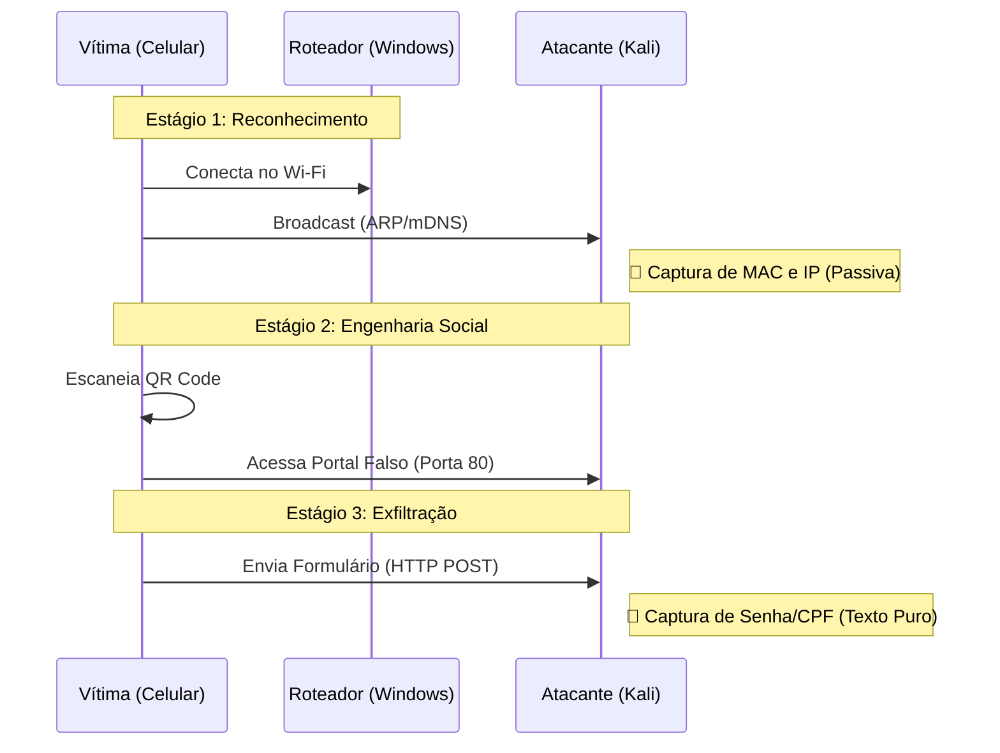

# Exploracao-Vulnerabilidade-HTTP

# 🔐 PoC: Wi-Fi Credential Harvesting
### Exploração de Vulnerabilidades em Redes Wireless & Engenharia Social

 

> **⚠️ AVISO LEGAL (DISCLAIMER)**
> 
> Este repositório contém documentação e códigos desenvolvidos estritamente para fins acadêmicos na disciplina de **Redes de Computadores II**. Todas as demonstrações foram realizadas em ambiente controlado (Laboratório Virtual), utilizando dados fictícios e dispositivos próprios.

---

## 📑 1. Sumário Executivo

Este projeto apresenta uma Prova de Conceito (PoC) demonstrando a **insegurança do protocolo HTTP** em redes públicas. O experimento simula um ataque de *Rogue Access Point* (Ponto de Acesso Malicioso) combinado com Engenharia Social para capturar credenciais de usuários em texto claro (*Cleartext*).

### 🎯 Objetivos do Projeto
- [x] Criar um ambiente controlado de ataque Wireless.
- [x] Demonstrar a interceptação de dados sem criptografia (TLS/SSL).
- [x] Analisar o tráfego de rede (`.pcap`) com Wireshark.
- [x] Desenvolver medidas de mitigação (Defesa).

---

## 🏗️ 2. Arquitetura e Topologia

O laboratório foi configurado utilizando uma abordagem híbrida para contornar restrições de hardware físico.

| Componente | Especificação | Função no Ataque |
| :--- | :--- | :--- |
| **🖥️ Host Físico** | Windows 10/11 + Adaptador Intelbras | **Infraestrutura:** Provedor de Acesso (Hotspot) |
| **🏴‍☠️ Atacante** | Kali Linux (VirtualBox Bridge) | **Servidor:** Hospedagem do Phishing + Sniffer |
| **📱 Vítima** | Smartphone Android (S23 Ultra) | **Cliente:** Conectado à rede maliciosa |

---

## ⚙️ 3. Metodologia: O Desafio e a Solução

### 🔴 O Problema (Restrição de Infraestrutura)
O plano original consistia em um ataque *Man-in-the-Middle* via **ARP Spoofing**. Contudo, identificamos que o driver de Hotspot do Windows implementa nativamente o **Isolamento de Cliente (Client Isolation)**.
> *Isso impede que dispositivos na mesma rede Wi-Fi troquem pacotes diretamente, bloqueando a interceptação tradicional.*

### 🟢 A Solução (Engenharia Social)
Para contornar o bloqueio, alteramos o vetor de ataque para **Phishing Assistido**:

#### 🔗 Ferramentas de Indução (QR Codes)
A tabela a seguir apresenta as duas ferramentas visuais utilizadas na simulação para guiar a vítima ao servidor malicioso:

| 1. QR Code de Conexão (Fase de Engano) | 2. QR Code de Validação (O Gatilho) |
| :---: | :---: |
| **Função:** Simula um acesso legítimo à rede e credibilidade. | **Função:** Redireciona a vítima ao IP do atacante (`http://192.168.137.177`). |
|  |  |

    <i>O escaneamento do código da direita é a ação crítica que inicia a captura das credenciais.</i>

------
## 🔄. Ciclo de Vida do Ataque (Attack Lifecycle)

O ataque ocorre em três estágios técnicos distintos. Abaixo, detalhamos o fluxo de dados e a vulnerabilidade explorada em cada fase:

### 📝 Detalhamento Técnico das Fases

#### 📡 Estágio 1: Reconhecimento Passivo (Conexão)
Ao conectar-se ao Wi-Fi, o dispositivo da vítima envia pacotes de *Broadcast* e *Multicast* (ARP/mDNS) para se anunciar na rede.
* **O que acontece:** O Wireshark captura passivamente esses pacotes na interface de rede.
* **Dados Vazados:** `Endereço MAC` (Camada 2) e `Endereço IP` (Camada 3).
* **Impacto:** 🚨 Identificação física do hardware e rastreio de presença, quebrando a privacidade do usuário antes mesmo do login.

#### 🔗 Estágio 2: A Isca (Engenharia Social)
Devido ao bloqueio de redirecionamento automático do Windows (*Client Isolation*), utilizamos um vetor humano. A vítima é exposta a um QR Code com a mensagem *"Escaneie para Validar o Acesso"*.
* **Técnica:** O QR Code atua como um link malicioso físico.
* **Resultado:** Ao escaneá-lo, o usuário autoriza explicitamente a conexão com o servidor do atacante (`http://192.168.137.177`), contornando o firewall do Host.

#### 🔓 Estágio 3: Exfiltração de Dados (O Roubo)
A vítima preenche o formulário de "Cadastro Wi-Fi" acreditando ser um procedimento padrão de autenticação.
* **A Vulnerabilidade:** O navegador envia os dados via método **HTTP POST**.
* **O Problema:** Como não há criptografia (SSL/TLS), os dados trafegam em **Texto Puro** (*Cleartext*).
* **A Captura:** O sniffer intercepta o pacote completo, revelando Nome, E-mail e Senhas.
  
--------

## 📸 4. Evidências e Prova Visual

### A. Interface Apresentada à Vítima
*A página de login de Wi-Fi, simulando um portal corporativo:*

    
     

### B. A Prova do Crime (Wireshark)
*Captura do pacote HTTP POST contendo os dados pessoais em texto puro:*

    
     

---

## 📊 5. Análise de Exfiltração de Dados

Durante a fase de exploração, a infraestrutura de monitoramento interceptou **100% das requisições de autenticação**. A inspeção profunda dos pacotes (Deep Packet Inspection) revelou a violação do pilar de **Confidencialidade**, expondo dados de contato em texto puro.

Abaixo, a classificação dos ativos comprometidos:

| Ativo (Campo) | Natureza do Dado | Classificação de Risco | Impacto Potencial |
| :--- | :--- | :--- | :--- |
| `txtNome` | Identificação | 🟠 **ALTO** | Engenharia Social e Perfilamento da Vítima. |
| `txtEmail` | Login / Contato | 🟠 **ALTO** | Vetor para Phishing Direcionado e Spam. |
| `txtTelefone` | **PII (Pessoal)** | 🔴 **CRÍTICO** | **Clonagem de WhatsApp, Smishing e Interceptação de SMS (2FA).** |

> **Diagnóstico:** A ausência de criptografia de transporte (TLS) permitiu a leitura integral do payload. O vazamento do número de telefone expõe a vítima a ataques diretos em mensageiros instantâneos.

**Evidência Visual:**
*O print do Wireshark abaixo corrobora a falha, destacando a legibilidade dos campos no painel de inspeção:*

    
     

---

## 🛡️ 6. Contramedidas e Mitigação (Blue Team)

Para mitigar a vulnerabilidade demonstrada e proteger a rede contra ataques semelhantes, as seguintes medidas defensivas devem ser implementadas:

### 1. Implementação de HTTPS (Criptografia de Transporte)
* **Mecanismo:** Utiliza o protocolo **TLS/SSL** (Transport Layer Security) para estabelecer um canal seguro, criptografando os dados no cliente.
* **Efeito:** Mesmo que o atacante intercepte os pacotes na rede local, o conteúdo estaria ilegível, frustrando o ataque de captura de credenciais.

### 2. Uso de VPN e Validação de Endpoint
* **Mecanismo:** Ao utilizar uma **VPN (Rede Privada Virtual)**, todo o tráfego da vítima é encapsulado em um túnel criptografado, impedindo a leitura por terceiros na rede local.
* **Mecanismo:** **HSTS** (HTTP Strict Transport Security) instrui o navegador a *nunca* carregar a página via HTTP, mitigando tentativas de downgrade ou acesso a links inseguros.

### 3. Conscientização do Usuário
* **Foco:** Treinar usuários para verificar a URL e a barra de segurança (cadeado verde/HTTPS) antes de inserir qualquer informação pessoal.

---

### 👨‍💻 Desenvolvido por
**Kayan Paiva Pereira** • [Nome Amigo 2] • [Nome Amigo 3] • [Nome Amigo 4]

 

*Trabalho apresentado ao curso de Sistemas de Informação - Novembro/2025*

