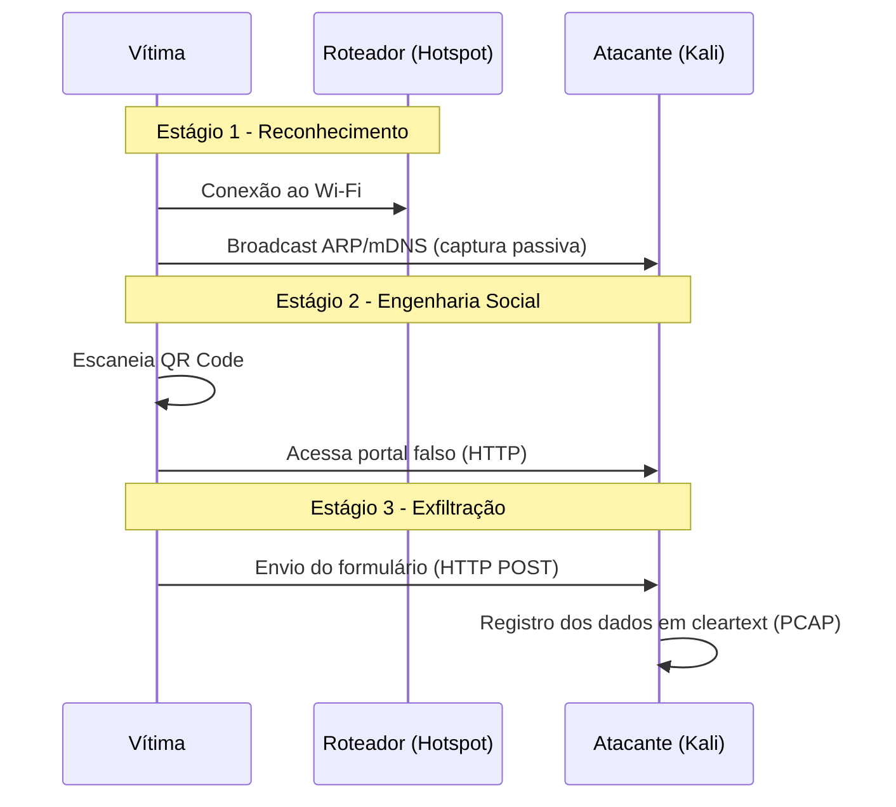

# 🔐 Exploração de Vulnerabilidades em Redes Wireless com Foco em HTTP Inseguro

<div align="center">

⚠️ **AVISO LEGAL (DISCLAIMER)**  
Este repositório foi produzido exclusivamente para fins acadêmicos na disciplina de **Redes de Computadores II**.  
Todos os testes foram realizados em ambiente isolado, com dados fictícios e consentidos, seguindo as orientações de segurança do curso.

</div>

---

## 📑 1. Sumário Executivo

Este projeto apresenta uma **Prova de Conceito (PoC)** sobre a exploração de vulnerabilidades em redes Wi-Fi públicas, demonstrando o impacto do uso do protocolo **HTTP sem criptografia**.  
O cenário simula um **Rogue Access Point + Engenharia Social**, demonstrando como credenciais podem ser capturadas em **texto claro** (cleartext) por meio de um simples formulário não criptografado.

### 🎯 Objetivos

- Criar um ambiente controlado de rede wireless vulnerável.  
- Demonstrar a interceptação de dados transmitidos via HTTP.  
- Registrar e analisar pacotes em um arquivo **PCAP** (Wireshark).  
- Apresentar contramedidas de segurança.  
- Disponibilizar documentação completa e reprodutível.  

---

## 🏗️ 2. Arquitetura e Topologia

O ambiente foi montado utilizando uma **topologia híbrida**, devido a limitações do hotspot nativo do Windows.

### **Componentes Utilizados**

| Componente               | Especificação         | Função                                           |
|-------------------------|------------------------|--------------------------------------------------|
| Host Físico (Windows)  | Hotspot Integrado      | Provê rede Wi-Fi para o teste                   |
| Máquina Atacante (Kali) | VM em modo Bridge      | Hospeda o servidor malicioso e captura tráfego  |
| Vítima                  | Smartphone/PC          | Acessa o portal falso e envia dados             |

---

## ⚙️ 3. Metodologia

### **3.1 Limitações Identificadas**

O plano original previa um ataque **Man-in-the-Middle (MitM)** via **ARP Spoofing**, mas o hotspot nativo do Windows habilita automaticamente:

- **Client Isolation**  
- Bloqueio de comunicação direta entre clientes  

Isso impede o envio de *respostas ARP falsas* ao alvo.

### **3.2 Adaptação da Estratégia (Engenharia Social)**

Optou-se pela utilização de um **QR Code malicioso** para induzir a vítima a acessar um portal falso hospedado no atacante.

### QR Codes Criados

<div align="center">

| QR Code de Acesso | QR Code de "Validação" |
|------------------|-------------------------|
| Simula credibilidade | Redireciona para o atacante |
|  |  |

</div>

---

## 🔄 4. Ciclo de Vida do Ataque



---

## 📝 5. Análise Técnica

### 📡 **Estágio 1: Reconhecimento Passivo**

Ao se conectar ao Wi-Fi, o dispositivo emite:

- ARP  
- mDNS  
- DHCP  

O atacante obtém:

- **MAC Address**  
- **Endereço IP**  
- **Hostname (quando disponível)**  

---

### 🔗 **Estágio 2: Engenharia Social**

O QR Code age como **substituto de captive portal**, redirecionando a vítima para um servidor HTTP na máquina atacante.

---

### 🔓 **Estágio 3: Exfiltração de Dados**

O formulário falso envia:

```
HTTP POST /login
Content-Type: application/x-www-form-urlencoded
```

Como **não há TLS**, todo o conteúdo aparece no Wireshark em **texto legível**.

---

## 📸 6. Evidências

### **6.1 Portal Falso exibido à vítima**
<div align="center">

</div>

### **6.2 Captura do POST no Wireshark**
<div align="center">

</div>

---

## 📊 7. Classificação dos Dados Comprometidos

| Campo     | Tipo de Dado           | Risco    | Impacto                                        |
|-----------|-------------------------|----------|------------------------------------------------|
| Nome      | Identificação           |  #Médio#    | Perfilamento da vítima                         |
| E-mail    | Credencial de acesso    |  #Alto#    | Phishing e roubo de identidade                 |
| Telefone  | PII sensível            |  #Crítico# | Golpes via engenharia social em mensageiros    |

**Diagnóstico:**  
A ausência de criptografia expõe completamente a confidencialidade dos dados enviados pela vítima.

---

## 🛡️ 8. Contramedidas e Recomendações

### 🔐 **1. Camada de Aplicação — HTTPS/TLS**

- Utilizar certificados válidos  
- Impede leitura dos dados por sniffers locais  

---

### 🌐 **2. Camada de Rede — WPA3 + Defesa contra Rogue AP**

- Adotar **WPA3-Personal** ou **WPA3-Enterprise**  
- Ambientes corporativos → **802.1X + RADIUS**  
- Utilizar **WIDS/WIPS** para identificar APs falsos  

---

### 🛡️ **3. Camada de Navegador — HSTS**

- Obriga o navegador a comunicar-se apenas por **HTTPS**  

---

### 🎓 **4. Camada Humana — Conscientização**

- Verificar ícone de cadeado antes de inserir dados  
- Evitar escanear QR Codes desconhecidos  

---

## 🛠️ 9. Guia Completo de Reprodução

Este guia explica detalhadamente como reproduzir todo o ambiente utilizado no experimento, incluindo cada configuração, termo técnico e etapas necessárias para simular a captura de dados enviados via HTTP.

---

### 📌 1. Requisitos do Ambiente

- **Windows com hotspot ativo:** o Windows funciona como roteador Wi-Fi, criando a rede onde o dispositivo vítima irá se conectar.  
- **Kali Linux em modo Bridge:** a máquina virtual precisa estar configurada em *Bridge Mode* para receber um IP real da rede e conseguir interceptar tráfego.  
- **Dispositivo vítima conectado no SSID:** pode ser um celular ou notebook, que acessará o site falso.  
- **Wireshark instalado:** utilizado como analisador de pacotes.  
- **Repositório do servidor malicioso clonado.**  

---

### 📌 2. Verificação e Configuração da Interface de Rede (Kali Linux)

Antes de iniciar qualquer captura, é fundamental verificar se o Kali Linux está corretamente configurado na rede.

Use o comando:

```bash
ifconfig
```

O que você precisa observar:

- **Interface correta:** normalmente `eth0` (rede cabeada) ou `wlan0` (rede wi-fi).  
- **Endereço IPv4 válido:** algo como `192.168.x.x`.  
- **Gateway da rede:** confirma que o Kali realmente está dentro da rede criada pelo Windows.  
- **Máscara de sub-rede (netmask):** geralmente `255.255.255.0`.  

📍 **Cole aqui o print da sua configuração de rede (ifconfig ou print das configurações da VM):**
```
[COLE AQUI A IMAGEM DA CONFIGURAÇÃO DE REDE DO KALI]
```

Essas informações garantem que o Kali está **no mesmo segmento de rede do dispositivo vítima**, permitindo monitorar requisições HTTP enviadas por ele.

---

### 📌 3. Inicialização do Servidor HTTP Malicioso

O servidor malicioso é responsável por hospedar a página falsa que será acessada pela vítima. Essa página está dentro do diretório `src/` do projeto.

Execute:

```bash
git clone https://github.com/Kaypp21/Exploracao-Vulnerabilidade-HTTP.git
cd Exploracao-Vulnerabilidade-HTTP
sudo python3 -m http.server 80 --directory src/
```

Explicações importantes:

- **http.server:** módulo interno do Python que cria um servidor HTTP simples.  
- **Porta 80:** porta padrão de navegação HTTP (não utiliza criptografia).  
- **--directory src/:** especifica que o servidor deve disponibilizar os arquivos dentro da pasta `src/`.  
- O arquivo **index.html** dentro dessa pasta será carregado automaticamente por quem acessar o IP do atacante.

---

### 📌 4. Preparação da Captura no Wireshark

Com o servidor rodando:

1. Abra o **Wireshark**  
2. Selecione a **interface correta** (a mesma que aparece no ifconfig)  
3. Clique em **Start Capturing**  
4. Aplique o filtro para visualizar somente POSTs:

```text
http.request.method == POST
```

Explicações:

- **HTTP POST:** é o método usado quando um formulário envia dados para um servidor.  
- O filtro ajuda a isolar apenas os pacotes que contêm informações enviadas pela vítima (como usuário e senha).  
- Como é HTTP puro, os dados trafegam **sem criptografia**, permitindo visualizar tudo em texto claro.

---

### 📌 5. Fluxo da Execução do Ataque

Com o ambiente pronto, o passo a passo funciona assim:

- A vítima escaneia o **QR Code** previamente gerado, que aponta para o IP do servidor malicioso.  
- O navegador da vítima abre a página HTML falsa hospedada no Kali.  
- Ela preenche o formulário acreditando ser legítimo.  
- Ao clicar em *Enviar*, o navegador envia uma requisição HTTP POST.  
- O Wireshark captura esse pacote imediatamente.  
- Nos detalhes do pacote, é possível visualizar os campos enviados, como:

```
nome=teste123
email=email@123.com
numero de telefone=320000000
```

Isso demonstra a vulnerabilidade: **dados sensíveis podem ser roubados facilmente quando não há HTTPS**.

---

### 📌 6. Encerramento e Validação da Captura

Após concluir o teste:

- Pare a captura no Wireshark  
- Analise os pacotes identificados  
- Verifique o conteúdo enviado no POST em "Form Data" ou "Raw"  
- Confirme que os dados foram transmitidos sem criptografia  
- Documente a evidência conforme exigido no relatório 

### **4. Execução**

- A vítima escaneia o QR Code  
- Acessa o portal falso  
- Preenche o formulário  
- Os dados aparecem no Wireshark em tempo real  

---

<div align="center">

👨‍💻 **Desenvolvido por:**  
**Kayan Paiva Pereira • Enzo José Oliveira Pereira • Livya Silva de Carvalho • Nathan Massamb Belinato**

_Trabalho apresentado ao curso de Sistemas de Informação — Novembro/2025_

</div>
